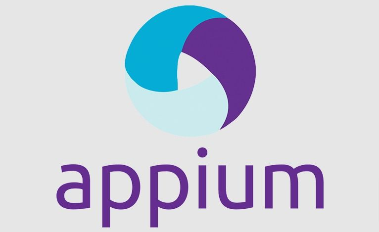

## Дипломный проект содержит набор автотестов на сайт https://lenta.com/
  - ### WEB
  - ### API
  - ### MOBILE (Android) 

Запуск может выполняться ка локально, так и удаленно на selenoid сервере или через browserstack

Язык: Java
Для формирования отчетов используется Allure TestOps|Allure Report

Используемые технологии
Java, JUNIT5, Gradle, Senenide, RestAssured, Selenoid, Appium, Allure TestOps|Allure Report , Appium Inspector, SCRPY, Inte;jIdea, Android Studio





### Jenkins Job

```
https://jenkins.autotests.cloud/job/QaLenta/
```


### Запуск

#### Локально Web
```
gradle clean ui -Dplatform=web
gradle clean ui -DenvironmentType=local -Dplatform=web
```
#### Удаленно Web
```
gradle clean ui -DenvironmentType=remote -Dplatform=web
```
#### Запуск API локально
```
gradle clean api -DenvironmentType=local -Dplatform=web
gradle clean api -DenvironmentType=local -Dplatform=remote
```
#### Реальная Мобилка
```
gradle clean android -DdeviceHost=real -DmobileOS=android
gradle clean android -Dplatform=mobile -DdeviceHost=real -DmobileOS=android -Ddevice=redmi9A
```

#### Эмулятор Мобилка
```
gradle clean android -Dplatform=mobile -DdeviceHost=emulation -DmobileOS=android -Ddevice=pixel4
```
#### BrowserStack Мобилка
```
gradle clean android -Dplatform=mobile -DdeviceHost=browserstack -DmobileOS=android -Ddevice=pixel6Pro
```

<!---Пример кода-->
[](https://git.io/typing-svg)


## TODO

- [X] Запуск в Jenkins
  - [ ] переделать на paip
- [X] Подключить аллюр
- [X] Подключить telegramm
- [X] Дописать автотесты по UI
- [X] Дописать автотетсы по АПИ
- [X] Дописать автотесты по Mobile
- [ ] Сделать скриншоты и описание