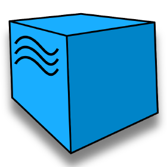

## Дипломный проект содержит набор автотестов на сайт https://lenta.com/


## Содержание:

- [Технологии и инструменты](#tools)
- [Тестовое покрытие](#cases)
- [Локальный запуск тестов](#localrun)
- [Запуск тестов в Jenkins](#remoterun)
- [Allure отчёт](#report)
- [Интеграция с Allure TestOps](#testops)
- [Уведомления в Telegram](#telegram)
- [Видео с примером запуска тестов в Selenoid](#video)

<a id="tools"></a>
### Технологии и инструменты:

<div align="center">
<a href="https://www.jetbrains.com/idea/"></a>
<a href="https://www.android.com/">  </a> 
<a href="https://developer.android.com/studio">  </a> 
<a href="https://github.com/"></a>  
<a href="https://www.java.com/"></a>
<a href="https://gradle.org/"></a>  
<a href="https://junit.org/junit5/"></a>
<a href="https://selenide.org/"></a>
<a href="https://www.browserstack.com/">  </a>
<a href="https://appium.io/">  </a>
<a href="https://aerokube.com/selenoid/"></a>
<a href="https://rest-assured.io/"></a>
<a href="https://www.jenkins.io/"></a>
<a href="https://github.com/allure-framework/"></a>
<a href="https://qameta.io/"></a>
<a href="https://telegram.org/"></a>
</div>

<a id="cases"></a>
### Тестовое покрытие
- #### WEB
  - ##### Пользователь может работать с каталогом товаров
    - Успешный переход в каталог 1-го уровня
    - Успешный переход в каталог 2-го уровня
  - ##### Пользователь может авторизоваться через кнопку 'Войти'
    - Кнопка 'Получить код' не активна до ввода номера телефона
    - "Кнопка 'Получить код' активна после ввода номера телефона"
    - "Открыто окно 'Введите код'"
  - ##### Пользователь может найти товар
    - Успешный поиск товара через строку поиска
- #### API
  - ##### Пользователь не может авторизоваться если в запросе некорректные данные
    - Запрашиваемый media-type не поддерживается
    - Ошибка 403: Нет аккаунта с указанным номером телефона
  - ##### Неавторизованный пользователь может получить информацию о товаре
    - Успешное получение данных товара по SKU
    - Успешный поиск товара в каталоге
  - ##### Неавторизованный пользователь может получить информацию о магазинах
    - Успешное получение данных о магазине номер
    - Успешное получение данных о всех магазинах
    - Успешное получение информации о доставке
- #### MOBILE (Android)
  - ##### Пользователь может получить информацию о магазине и товарах в нем
    - Успешный выбор магазин через строку поиска
    - Успешный поиск товара через строку поиск
    - Успешный выбор товара через строку поиска


### Запуск тестов в Jenkins

```
https://jenkins.autotests.cloud/job/QaLenta/
```

Запуск может выполняться как локально, так и удаленно на Selenoid сервере или через browserstack

### Запуск

#### Локально Web
```
gradle clean ui -Dplatform=web
gradle clean ui -DenvironmentType=local -Dplatform=web
```
#### Удаленно Web
```
gradle clean ui -DenvironmentType=remote -Dplatform=web
```
#### Запуск API локально
```
gradle clean api -DenvironmentType=local -Dplatform=web
gradle clean api -DenvironmentType=local -Dplatform=remote
```
#### Реальная Мобилка
```
gradle clean android -DdeviceHost=real -DmobileOS=android
gradle clean android -Dplatform=mobile -DdeviceHost=real -DmobileOS=android -Ddevice=redmi9A
```

#### Эмулятор Мобилка
```
gradle clean android -Dplatform=mobile -DdeviceHost=emulation -DmobileOS=android -Ddevice=pixel4
```
#### BrowserStack Мобилка
```
gradle clean android -Dplatform=mobile -DdeviceHost=browserstack -DmobileOS=android -Ddevice=pixel6Pro
```

### Запуск тестов из Allure, отчеты и уведомления

### Allure TestOps


### Telegram


## TODO

- [X] Запуск в Jenkins
  - [ ] переделать на paip
- [X] Подключить аллюр
- [X] Подключить telegramm
- [X] Дописать автотесты по UI
- [X] Дописать автотетсы по АПИ
- [X] Дописать автотесты по Mobile
- [ ] Сделать скриншоты и описание